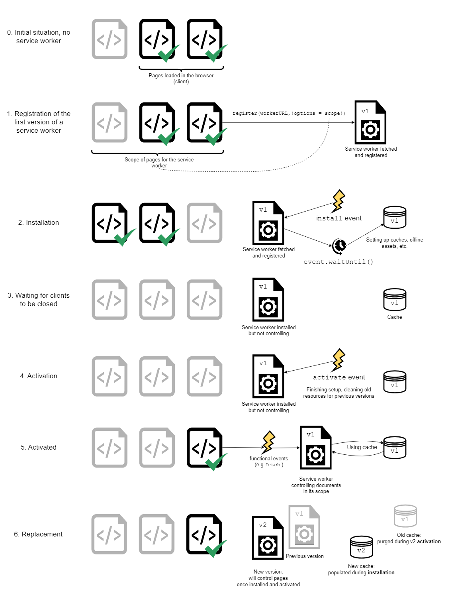

# Service Worker

**Steps to set up a service worker:**

1. Register the service worker in the main thread
2. Install the service worker
3. New installed service worker receive a activate event (when is safe to delete old service workers)
4. After activation, the service worker will now control pages, but only those that were opened after the register() is successful ( a document starts life with or without a service worker and maintains that for its lifetime. To override this default behavior and adopt open pages, a service worker can call clients.claim().)
5. Whenever a new version of a service worker is fetched, this cycle happens again and the remains of the previous version are cleaned during the new version's activation.

## Run

`npx lite-server`
